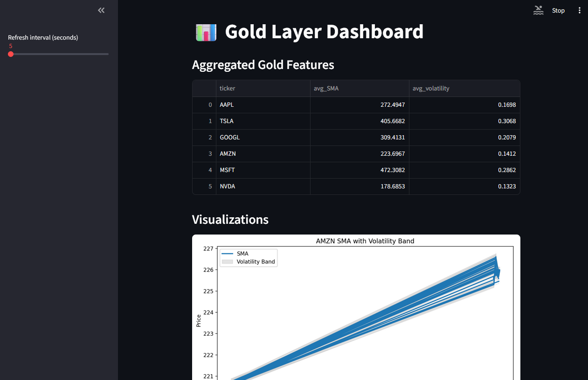
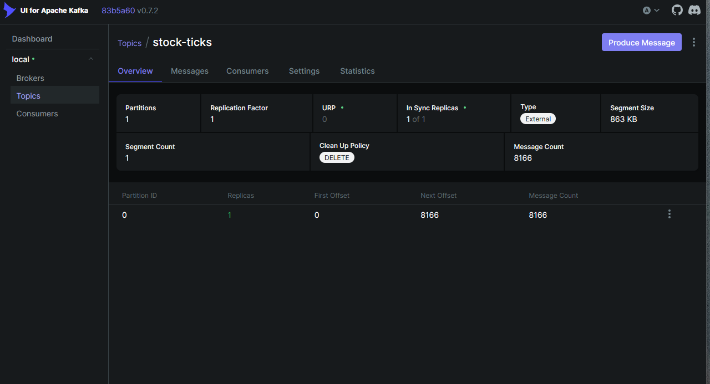
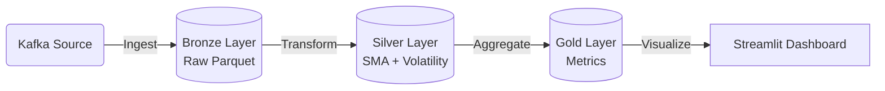

# 📈 Financial Analysis Engine – PySpark + Kafka Streaming

This project demonstrates a real‑time financial analysis pipeline using **PySpark Structured Streaming** with **Kafka** as the data source. It implements a **Medallion Architecture** pattern:

* **🥉 Bronze:** Raw Kafka events ingested directly into Parquet.
* **🥈 Silver:** Cleaned data with feature engineering (SMA, Volatility).
* **🥇 Gold:** Aggregated metrics ready for visualization.
* **📊 Dashboard:** Real-time visualization via Streamlit.


## Demo




## 🏗 Architecture



## 📦 Prerequisites

📦 Prerequisites
Apache Spark: 3.5.1 (Scala 2.12 build)

Python: 3.10+

Kafka: 3.4.1 (Local or Docker)

Virtual Environment: pyspark, streamlit, kafka-python installed.

🧪 Verified Environment
This pipeline has been validated on the following system configuration:

OS: Ubuntu 22.04 LTS (Kernel 6.8.0-60)

Python: 3.10.12

Pip: 22.0.2

Hardware: KVM/QEMU Virtual Machine (~5GB RAM)

---

## ⚙️ Setup Instructions

### 1. Install Kafka JARs for Spark
Spark does not bundle Kafka connectors by default. You must download them to your Spark JARs directory.

```bash
# Check where Spark is installed
echo $SPARK_HOME

cd $SPARK_HOME/jars

wget https://repo1.maven.org/maven2/org/apache/spark/spark-sql-kafka-0-10_2.12/3.5.1/spark-sql-kafka-0-10_2.12-3.5.1.jar

wget https://repo1.maven.org/maven2/org/apache/spark/spark-token-provider-kafka-0-10_2.12/3.5.1/spark-token-provider-kafka-0-10_2.12-3.5.1.jar

wget https://repo1.maven.org/maven2/org/apache/kafka/kafka-clients/3.4.1/kafka-clients-3.4.1.jar

wget https://repo1.maven.org/maven2/org/slf4j/slf4j-api/1.7.36/slf4j-api-1.7.36.jar

wget https://repo1.maven.org/maven2/org/apache/commons/commons-pool2/2.11.1/commons-pool2-2.11.1.jar

# Verify
ls -lh | grep kafka
```

### 2. Environment Setup
Activate your virtual environment:

```bash
cd Financial-Analysis-Engine
source venv/bin/activate
pip install -r requirements.txt
```

### 3. Start Infrastructure (Kafka/Zookeeper)
Start the services using Docker Compose:

```bash
cd src/financial-pyspark-stock-pipeline
docker compose up -d
```

---

## 🚀 Running the Pipeline

Open **4 separate terminal windows** to run the full pipeline.

#### Terminal 1: Kafka Producer
Generates synthetic stock ticks.
```bash
python src/producer.py
```

#### Terminal 2: Bronze Ingestion
Ingests stream to raw Parquet files.
```bash
python src/stream_ingest.py --sink parquet
```

#### Terminal 3: Silver Processing
Calculates Moving Averages and Volatility.
```bash
python src/process_silver.py --mode stream
```

#### Terminal 4: Dashboard
Launches the Streamlit UI.
```bash
streamlit run src/app.py
```

---

## 🗂 Project Structure

```text
Financial-Analysis-Engine/
│
├── venv/                       # Python virtual environment
├── src/
│   ├── producer.py             # Kafka producer (tick data)
│   ├── stream_ingest.py        # Bronze ingestion (Kafka → Parquet)
│   ├── process_silver.py       # Silver layer (clean + SMA/volatility)
│   ├── process_gold.py         # Gold layer (aggregations + plots)
│   └── app.py                  # Streamlit dashboard
│
└── datalake/
    ├── bronze/                 # Raw ingested parquet files
    ├── silver/                 # Feature-engineered parquet files
    └── gold/                   # Aggregated parquet files
```

---

## 📝 Usage Notes

1.  **Order Matters:** Run Producer → Ingest → Silver → Gold in sequence.
2.  **Logging:** If you see `SLF4J` warnings (NOP logger), they are harmless; Spark is just missing a logging backend configuration.
3.  **Alternative Run Method:**
    If you do not want to download JARs globally, you can inject them at runtime by setting the environment variable before running python:
    ```bash
    export PYSPARK_SUBMIT_ARGS="--jars /path/to/spark-sql-kafka-0-10_2.12-3.5.1.jar,... pyspark-shell"
    python stream_ingest.py
    ```